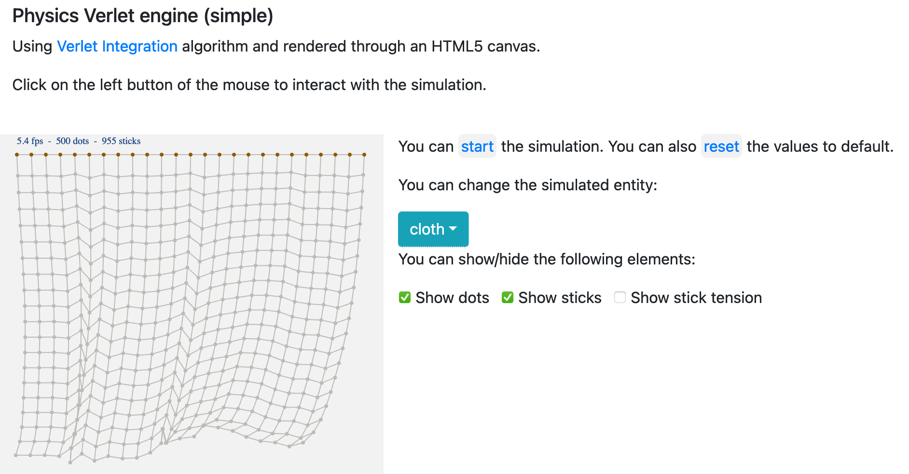
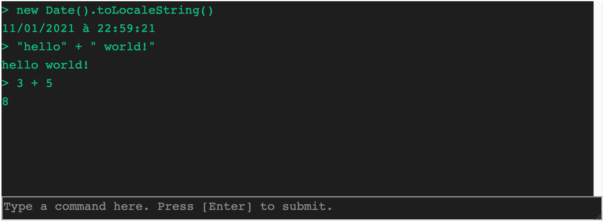

# playground-elm

[](https://github.com/ccamel/playground-elm/releases)
[](https://tldrlegal.com/license/mit-license)
[](https://app.fossa.io/projects/git%2Bgithub.com%2Fccamel%2Fplayground-elm?ref=badge_shield)
[](https://travis-ci.org/ccamel/playground-elm)
[](https://app.codacy.com/gh/ccamel/playground-elm/dashboard?branch=master)
[](http://elm-lang.org/)
[](https://getbootstrap.com/)
[](https://stackshare.io/ccamel/playground-elm)
[](https://ccamel.github.io/playground-elm/)

> My playground I use for playing with fancy and exciting technologies. This one's for [elm][].

## 🎯 Purpose

The purpose of this playground is to explore, study and assess the [elm][] language — a delightful language for reliable webapps.

The showcases are intended to be:

- **simple**: Fairly simple and understandable. Every showcase is implemented in a single elm file.
- **exploratory**:
  - _Highlight_ some aspects of the [elm][] language, like immutability, reactiveness, performance and
    interoperability with other JS libraries and CSS frameworks.
  - _Explore_ some architectural/design patterns around reactive static/serverless [SPA][]
- **playable**: As much as possible, provides a useful and enjoyable content.

## 🍿 Showcases

Visit the :small_blue_diamond: [demo site](https://ccamel.github.io/playground-elm/) and play in your browser.
The demo is a pure [SPA][] (100% clientside application) written in [elm][].

### Calc

Calc is a very simple and basic calculator.

<p align="center">
  <b>Links:</b><br>
  <a href="https://ccamel.github.io/playground-elm/#calc">Play</a>  |
  <a href="https://github.com/ccamel/playground-elm/blob/master/src/Page/Calc.elm">Code</a>
  <br><br>
  <kbd></kbd>
</p>

### Digital clock

Simple digital clock using [SVG][].

💡 Demonstrates some capabilities of [elm][] for displaying [SVG][] content.

<p align="center">
  <b>Links:</b><br>
  <a href="https://ccamel.github.io/playground-elm/#digital-clock">Play</a> |
  <a href="https://github.com/ccamel/playground-elm/blob/master/src/Page/DigitalClock.elm">Code</a>
  <br><br>
  <kbd></kbd>
</p>

### Lissajous

Animated [Lissajous figures](https://en.wikipedia.org/wiki/Lissajouss_curve) using [SVG][].

💡 Demonstrates how [elm][] can deal with some basic mathematical and handle animated [SVG][] rendering using
[MacCASOutreach/graphicsvg](https://package.elm-lang.org/packages/MacCASOutreach/graphicsvg/latest/) fantastic library.

<p align="center">
  <b>Links:</b><br>
  <a href="https://ccamel.github.io/playground-elm/#lissajous">Play</a> |
  <a href="https://github.com/ccamel/playground-elm/blob/master/src/Page/Lissajous.elm">Code</a>
  <br><br>
  <kbd></kbd>
</p>

### Maze generator

Maze generator using a [recursive backtracking](https://en.wikipedia.org/wiki/Maze_generation_algorithm#Recursive_backtracker)
algorithm with control of the generation process.

<p align="center">
  <b>Links:</b><br>
  <a href="https://ccamel.github.io/playground-elm/#maze">Play</a> |
  <a href="https://github.com/ccamel/playground-elm/blob/master/src/Page/Maze.elm">Code</a>
  <br><br>
  <kbd></kbd>
</p>

### Physics Verlet engine

Very simple physics engine using [Verlet Integration](https://en.wikipedia.org/wiki/Verlet_integration) algorithm and rendered through an HTML5 canvas.

💡 Demonstrates how [elm][] can deal with some basic mathematical and physical calculations, as well as basic rendering of objects in an HTML canvas,
using elementary functions from the fantastic [joakin/elm-canvas](https://package.elm-lang.org/packages/joakin/elm-canvas/latest/) package.

ℹ️ Implementation is inspired from [Making a Verlet Physics Engine in Javascript](https://anuraghazra.github.io/blog/making-a-verlet-physics-engine-in-javascript).

<p align="center">
  <b>Links:</b><br>
  <a href="https://ccamel.github.io/playground-elm/#physics-engine">Play</a> |
  <a href="https://github.com/ccamel/playground-elm/blob/master/src/Page/Physics.elm">Code</a>
  <br><br>
  <kbd></kbd>
</p>

<p align="center">
  
</p>

### Term

A basic terminal ([wsowens/term](https://github.com/wsowens/term)) which simply executes Javascript commands.

💡 Shows interoperability between [elm][] environment and JavaScript through [ports](https://guide.elm-lang.org/interop/ports.html).

<p align="center">
  <b>Links:</b><br>
  <a href="https://ccamel.github.io/playground-elm/#term">Play</a> |
  <a href="https://github.com/ccamel/playground-elm/blob/master/src/Page/Term.elm">Code</a>
  <br><br>
  <kbd></kbd>
</p>

## 🛠 Building and Running

### Elm 0.19

Elm 0.19 broke me as many other coders, due to a lot of changes on topics I used in this project with previous version:

- `elm.json` file
- JSON decoding
- String / Int / Float conversions
- Browser application, routing
- Url management
- date time (`Posix`, `Zone`)
- lots of incompatible packages
- ...

I finally managed to migrate to this new version but instabilities can be noticed though.

### Build

The project now relies on [parceljs][], a web application bundler which handles [elm][] builds at free.

At first, all the node packages this project depends on must be installed locally. This can be done with the
following command:

```bash
yarn
```

The build can be launched with:

```bash
yarn build
```

Then, open `./dist/index.html` file in your browser.

If you prefer, the site can be published by a local HTTP server. In this mode, if any change is detected, the build of
the project will be started again, and the site automatically updated in the browser; which is nice during the development phases.

The publication is launched with the following command:

```bash
yarn serve
```

The site is accessible through the `http://localhost:1234/` endpoint.

## 🔋 Technologies

- [`elm`](http://elm-lang.org/): ELM

  With the following (main and non exhaustive) packages:

  - [Chadtech/elm-vector](https://package.elm-lang.org/packages/Chadtech/elm-vector/latest/)
  - [avh4/elm-color](https://package.elm-lang.org/packages/avh4/elm-color/latest/)
  - [cuducos/elm-format-number](https://package.elm-lang.org/packages/cuducos/elm-format-number/latest/)
  - [elm-explorations/markdown](https://package.elm-lang.org/packages/elm-explorations/markdown/latest/)
  - [simonh1000/elm-colorpicker](https://package.elm-lang.org/packages/simonh1000/elm-colorpicker/latest/)
  - [joakin/elm-canvas](https://package.elm-lang.org/packages/joakin/elm-canvas/latest/)
  - [wsowens/term](https://package.elm-lang.org/packages/wsowens/term/latest/)
  - [MacCASOutreach/graphicsvg](https://package.elm-lang.org/packages/MacCASOutreach/graphicsvg/latest/)

- [`parceljs`](https://parceljs.org/): Web application bundler
- [`bootstrap`](https://getbootstrap.com/): Free and open-source CSS framework

## 📜 License

[MIT][] © [Chris Camel][]

[](https://app.fossa.io/projects/git%2Bgithub.com%2Fccamel%2Fplayground-elm?ref=badge_large)

[elm]: http://elm-lang.org/
[parceljs]: https://parceljs.org/
[spa]: https://en.wikipedia.org/wiki/Single-page_application
[svg]: https://en.wikipedia.org/wiki/Scalable_Vector_Graphics
[chris camel]: https://github.com/ccamel
[mit]: https://tldrlegal.com/license/mit-license
