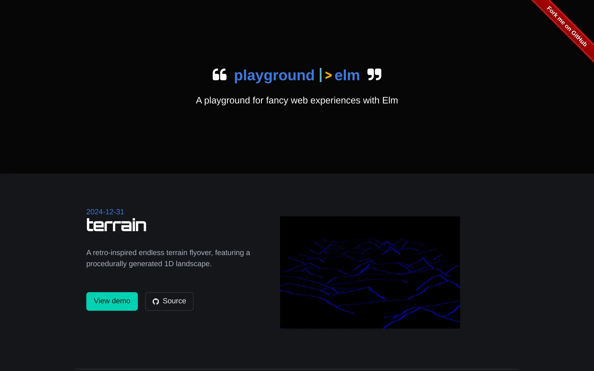

# `|>` playground-elm

[](https://github.com/ccamel/playground-elm/releases)
[](https://tldrlegal.com/license/mit-license)
[](https://app.fossa.io/projects/git%2Bgithub.com%2Fccamel%2Fplayground-elm?ref=badge_shield)
[](https://github.com/ccamel/playground-elm/actions/workflows/build.yml)
[](https://app.codacy.com/gh/ccamel/playground-elm/dashboard?branch=main)
[](http://elm-lang.org/)
<a href="https://bulma.io/"></a>
[](https://pnpm.io)
[](https://gitmoji.carloscuesta.me)
[](https://stackshare.io/ccamel/playground-elm)
[](https://ccamel.github.io/playground-elm/)

> My playground I use for playing with fancy and exciting technologies. This one's for [elm][].

## 🎯 Purpose

The purpose of this playground is to explore, study and assess the [elm][] language — a delightful language for reliable
webapps.

[](https://ccamel.github.io/playground-elm/)

The showcases are intended to be:

- **simple**: Fairly simple and understandable. Every showcase is implemented in a single elm file.
- **exploratory**:
  - _Highlight_ some aspects of the [elm][] language, like immutability, reactiveness, performance and interoperability
    with other JS libraries and CSS frameworks.
  - _Explore_ some architectural/design patterns around reactive static/serverless [SPA][]
- **playable**: As much as possible, provides a useful and enjoyable content.

## 🍿 Showcases

Visit the :small_blue_diamond: [demo site](https://ccamel.github.io/playground-elm/) and play in your browser.

The demo is a pure [SPA][] (100% clientside application) written in [elm][].

List of showcases:

- [terrain](https://ccamel.github.io/playground-elm/#terrain): A retro-inspired endless terrain flyover, featuring a procedurally generated 1D landscape, rendered in [SVG](https://en.wikipedia.org/wiki/Scalable_Vector_Graphics).

- [glsl](https://ccamel.github.io/playground-elm/#glsl): A dynamic [WebGL](https://www.khronos.org/webgl/) electricity effect created with [GLSL](https://en.wikipedia.org/wiki/OpenGL_Shading_Language) shaders, featuring interactive 3D rotation with smooth inertia.

- [soundWave toggle](https://ccamel.github.io/playground-elm/#sound-wave-toggle): A simple sound wave toggle button
  rendered in [SVG](https://en.wikipedia.org/wiki/Scalable_Vector_Graphics).

- [dApp](https://ccamel.github.io/playground-elm/#dapp): A straightforward decentralized application (dApp) that
  interfaces with various wallets, utilizing [EIP-6963](https://eips.ethereum.org/EIPS/eip-6963).

- [asteroids](https://ccamel.github.io/playground-elm/#asteroids): A simple clone of the classic game Asteroids,
  implemented in [Elm][] using the
  [Entity Component System (ECS)](https://en.wikipedia.org/wiki/Entity_component_system) pattern, rendered with
  [SVG](https://en.wikipedia.org/wiki/Scalable_Vector_Graphics).

- [term](https://ccamel.github.io/playground-elm/#term): A web-based terminal that evaluates JavaScript code using
  [Elm ports](https://guide.elm-lang.org/interop/ports.html) for interactivity.

- [physics](https://ccamel.github.io/playground-elm/#physics-engine): A straightforward physics engine utilizing the
  [Verlet Integration](https://en.wikipedia.org/wiki/Verlet_integration) algorithm, rendered on an HTML5 canvas.

- [maze](https://ccamel.github.io/playground-elm/#maze): A maze generator crafted using the
  [recursive backtracking](https://en.wikipedia.org/wiki/Maze_generation_algorithm#Recursive_backtracker) algorithm.

- [digital clock](https://ccamel.github.io/playground-elm/#digital-clock): A digital clock demo, visually represented
  using [SVG](https://en.wikipedia.org/wiki/Scalable_Vector_Graphics).

- [lissajous](https://ccamel.github.io/playground-elm/#lissajous): Animation of
  [Lissajous](https://en.wikipedia.org/wiki/Lissajous_curve) figures, depicted in
  [SVG](https://en.wikipedia.org/wiki/Scalable_Vector_Graphics).

- [calc](https://ccamel.github.io/playground-elm/#calc): A basic calculator designed for simple arithmetic operations.

## 🛠 Building and Running

### Elm 0.19

Elm 0.19 broke me as many other coders, due to a lot of changes on topics I used in this project with previous version:

- `elm.json` file
- JSON decoding
- String / Int / Float conversions
- Browser application, routing
- Url management
- date time (`Posix`, `Zone`)
- lots of incompatible packages
- ...

I finally managed to migrate to this new version but instabilities can be noticed though.

### Prerequisites

Be sure to have the following properly installed:

- [Node.js](https://nodejs.org/ru/) `v22.20` ([lts/jod](https://nodejs.org/en/download/archive/v22.20.0))
- [pnpm](https://pnpm.io/) `v10.15`

### Build

The project now relies on [parceljs][], a web application bundler which handles [elm][] builds at free.

At first, all the node packages this project depends on must be installed locally. This can be done with the following
command:

```bash
pnpm install
```

The build can be launched with:

```bash
pnpm build
```

Then, open `./dist/index.html` file in your browser.

If you prefer, the site can be published by a local HTTP server. In this mode, if any change is detected, the build of
the project will be started again, and the site automatically updated in the browser; which is nice during the
development phases.

The publication is launched with the following command:

```bash
pnpm serve
```

The site is accessible through the `http://localhost:1234` endpoint.

## 🔋 Technologies

- [`elm`](http://elm-lang.org/): ELM

  With the following (main and non exhaustive) packages:

  - [Chadtech/elm-vector](https://package.elm-lang.org/packages/Chadtech/elm-vector/latest/)
  - [avh4/elm-color](https://package.elm-lang.org/packages/avh4/elm-color/latest/)
  - [cuducos/elm-format-number](https://package.elm-lang.org/packages/cuducos/elm-format-number/latest/)
  - [elm-explorations/markdown](https://package.elm-lang.org/packages/elm-explorations/markdown/latest/)
  - [simonh1000/elm-colorpicker](https://package.elm-lang.org/packages/simonh1000/elm-colorpicker/latest/)
  - [joakin/elm-canvas](https://package.elm-lang.org/packages/joakin/elm-canvas/latest/)
  - [wsowens/term](https://package.elm-lang.org/packages/wsowens/term/latest/)
  - [MacCASOutreach/graphicsvg](https://package.elm-lang.org/packages/MacCASOutreach/graphicsvg/latest/)
  - [harmboschloo/elm-ecs](https://package.elm-lang.org/packages/harmboschloo/elm-ecs/latest/)
  - [BrianHicks/elm-particle](https://github.com/BrianHicks/elm-particle)
  - [elm-explorations/webgl](https://github.com/elm-explorations/webgl)
  - [nphollon/geo3d](https://github.com/nphollon/geo3d)

- [`parceljs`](https://parceljs.org/): Web application bundler
- [`bulma`](https://bulma.io/): The modern CSS framework

## 📜 License

[MIT][] © [Chris Camel][]

[](https://app.fossa.io/projects/git%2Bgithub.com%2Fccamel%2Fplayground-elm?ref=badge_large)

[elm]: http://elm-lang.org/
[parceljs]: https://parceljs.org/
[spa]: https://en.wikipedia.org/wiki/Single-page_application
[chris camel]: https://github.com/ccamel
[mit]: https://tldrlegal.com/license/mit-license
